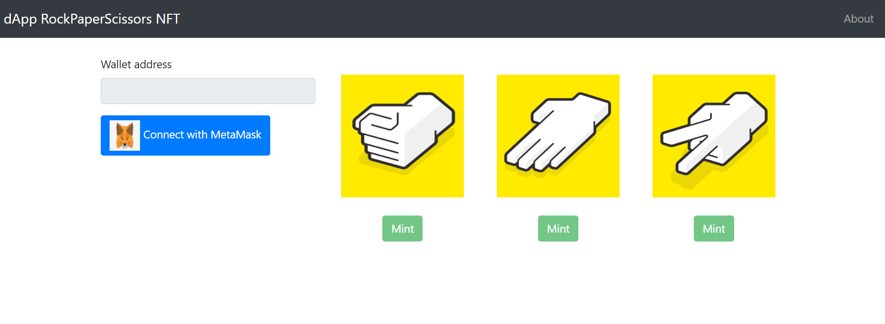

# edu_dApp (RockPaperScissors NFT)
Assignment for the course "Ecosystem of distributed registries"

## Stack
| Purpose | Technology |
| ---------- | ---------- |
| Network | TestNet (Rinkeby |
| Virtual Wallet | MetaMask |
| Ethereum Provider API | Alchemy |
| Python Ethereum API | web3.py |
| SmartContact (SC) Lang | Solidity |
| Minting NFT Standart | ERC-1155 |
| IPFS | NGT.Storage |
| Compile&Deploy SC | Brownie |
| Backend App | Flask |
| Frontend App | Flask Templates & jQuery |
| Front API with wallet | MetaMask API |

## Architecture

## SetUp steps
1. Configure Enviroment
   * Create virtual enviroment: `python -m venv venv`
   * Connect to venv: `source venv/bin/activate`
   * Install dependecies: `pip install -r requirements.txt & pipx install eth-brownie`
2. Set env variables:
   * Create .env file: `cp schema.env .env`
   * Fill file:
       * `WEB3_ALCHEMY_PROJECT_ID` - ID of dApp prject in https://dashboard.alchemyapi.io/apps
       * `ACCOUNT_ADDRESS` & `ACCOUNT_PRIVATE_KEY` - cred of main account
       * `CONTRACT_ADDRESS` - fill after deploy
3. Conf Brownie:
   * Change Ethereum Provider API: `brownie networks set_provider alchemy`
   * Add main account: `brownie accounts new deployment_account`
4. Deploy Smart Contract: `brownie run deploy.py --network rinkeby`

## Usage
> Run: `flask run`. And go to -> http://127.0.0.1:5000

1. First you need to connect an account via MetaMask
2. Next you can minting the NFT tokens. Remember the rules:
   * You can have only 1 token of the same type
   * You cannot take a token that is defeated by the token you have
